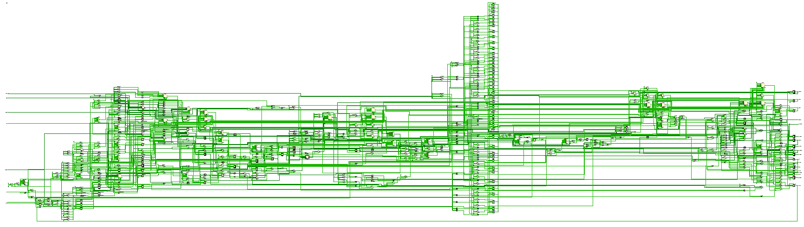
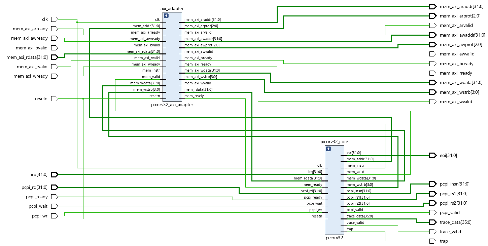
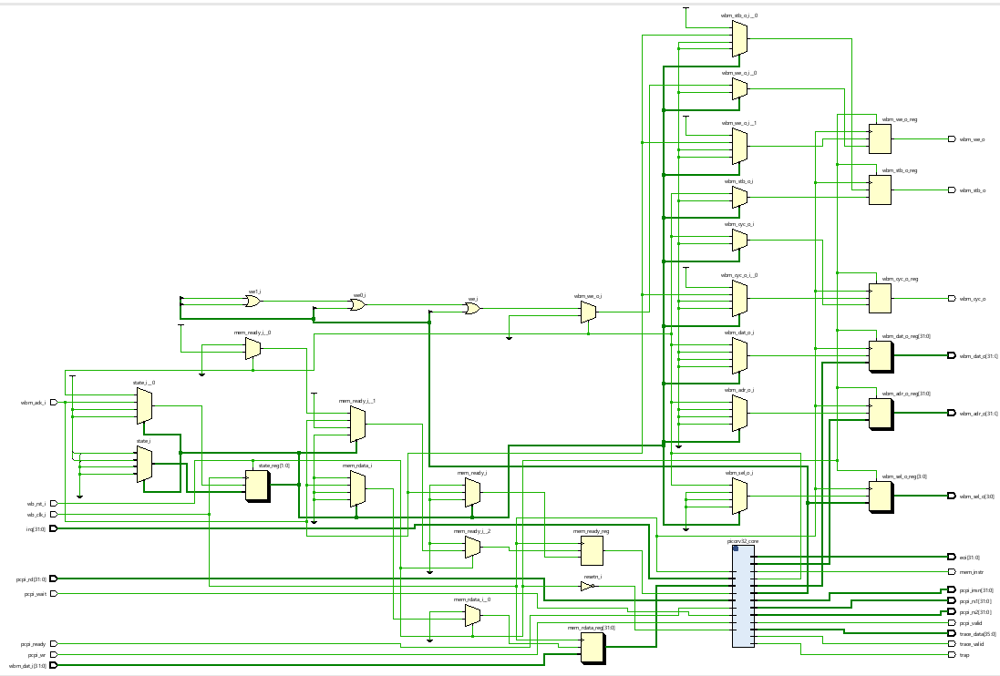
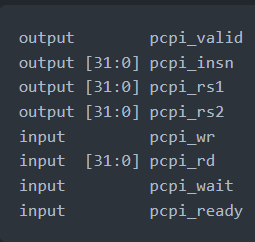
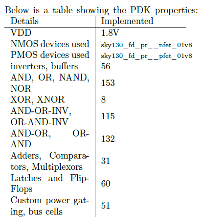
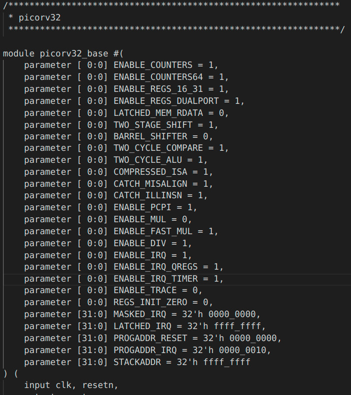
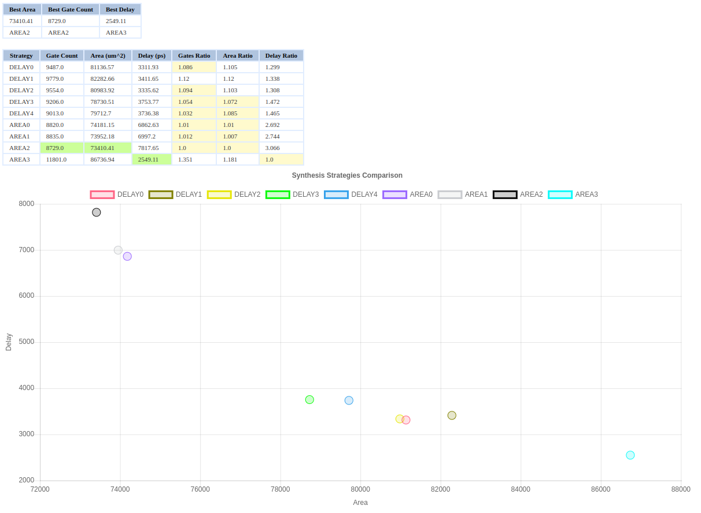

# [RISC-V-based-micro-controller-using-OpenLane](https://github.com/krutideepanpanda/RISC-V-based-micro-controller-using-OpenLane)

This project was done by - 

- [Kruti Deepan Panda](https://github.com/krutideepanpanda)
- [Rahul Magesh](https://github.com/RAZ4AMZ)

Credit to -

- [PicoRV32](https://github.com/YosysHQ/picorv32)
- [OpenLane](https://github.com/The-OpenROAD-Project/OpenLane)

This project explores the highly customizable PicoRV32 and explores its various configurations.
We have tried running the base core enabled with PCPI, AXI version of the core with PCPI
and multiply module enabled, AXI version of the core with PCPI, multiply module, 2 clock
cycle ALU and 2 clock cycle compare enabled. We tried to fix errors and STA violations that occurred during our runs and tried to determine the highest possible clock frequency the core can run in the most stable manner possible.

## Project details

### PicoRV32

​																							**Base core**

The PicoRV32 is a higly customizable core by YosysHQ. The PicoRV32 is a small core in terms of area but has high configurability. It
can be configured as RV32E, RV32I, RV32IC, RV32IM, or RV32IMC core, and optionally contains a built-in interrupt controller. [5] On top of that the core supports multiple memory interfaces. The core exists in three variations: picorv32, picorv32_axi and picorv32_wb. The first provides a simple native memory interface, that is easy to use in simple environments.
picorv32_axi provides an AXI-4 Lite Master [4] interface that can easily be integrated with existing systems that are already using the AXI standard. picorv32_wb provides a Wishbone master interface [5].

The core also includes a separate core picorv32_axi_adapter is provided to bridge between the native memory interface and
AXI4. This core can be used to create custom cores that include one or more PicoRV32 cores together with local RAM, ROM, and
memory-mapped peripherals, communicating with each other using the native interface, and communicating with the outside world via AXI4. [5]

​																					**AXI Interface Enabled**

​																					**Wishbone Interface Enabled**

PicoRV32 comes with internal verilog parameters which can be modified to generate our desired core. These internal parameters can be modified to implement additional features of the base core. When a parameter is set the corresponding logic or modules is generated using the *generate* keyword in verilog. Some parameters are explained below.

#### 	COMPRESSED_ISA

This enables support for the RISC-V Compressed Instruction Set [5]. By default it is 0.

#### 	ENABLE_PCPI

Set this to 1 to enable the Pico Co-Processor Interface (PCPI) [5]. By default it is 0.

#### 	ENABLE_MUL

This parameter internally enables PCPI and instantiates the *picorv32_pcpi_mu*l core that implements the MUL[H[SU|U]] instructions. The external PCPI interface only becomes functional when ENABLE_PCPI is set as well [5]. By default it is 0.

#### 	ENABLE_FAST_MUL

This parameter internally enables PCPI and instantiates the *picorv32_pcpi_fast_mu*l core that implements the MUL[H[SU|U]] instructions. The external PCPI interface only becomes functional when ENABLE_PCPI is set as well [5]. By default it is 0.

#### 	ENABLE_DIV

This parameter internally enables PCPI and instantiates the *picorv32_pcpi_div* core that implements the DIV[U]/REM[U] instructions. The external PCPI interface only becomes functional when ENABLE_PCPI is set as well [5].

#### 	TWO_CYCLE_COMPARE

This relaxes the longest data path a bit by adding an additional FF stage at the cost of adding an additional clock cycle delay to the
conditional branch instructions. By default it is 0 [5].

*Note: Enabling this parameter will be most effective when retiming (aka "register balancing") is enabled in the synthesis flow.*

#### 	TWO_CYCLE_ALU

This adds an additional FF stage in the ALU data path, improving timing at the cost of an additional clock cycle for all instructions that use the ALU. By default it is 0 [5].

*Note: Enabling this parameter will be most effective when retiming (aka "register balancing") is enabled in the synthesis flow.*

### Pico Co-Processor Interface (PCPI)

The thing that makes PicoRV32 ideal for use in microcontrollers is its Pico Co-Processor Interface (PCPI) feature. The PCPI is an interface that can be enabled by changing verilog parameters as mentioned above. PCPI helps adding additional functionality to the core easier provided they are non-branching instructions.

When an unsupported instruction is found by PicoRV32 occurs it asserts pcpi_valid. The unsopported instruction is sent to pcpi_insn for the co-processor to recognise it. The decoded values of registers is made available through pcpi_rs1 and pcpi_rs2 and its output can be sent to pcpi_rd. The pcpi_ready needs to asserted when the execution of the instruction is over.

When no external PCPI core acknowledges the instruction within 16 clock cycles, then an illegal instruction exception is raised and the respective interrupt handler is called. A PCPI core that needs more than a couple of cycles to execute an instruction, should assert pcpi_wait as soon as the instruction has been decoded successfully and keep it asserted until it asserts pcpi_ready.
This will prevent the PicoRV32 core from raising an illegal instruction exception. [5]

### Stages of the Flow

#### 	Synthesis

This is the very first stage of the flow. Most of the initial preparation happens in this stage. OpenLane first goes through the mentioned source files and looks through it for optimising it. Initially it tries to remove dead code. Dead code analysis involves unnecessary wires and modules that has never been used by any module. Dead code analysis is important as it helps OpenLane
to focus on only the relevant verilog code. At the end of the synthesis stage the verilog file is replaced by optimized wires and standard modules by Skywater. We can also run synthesis exploration and understand which of the multiple variations of optimizations is better suited for our use case.

#### 	

Chip Floorplanning is the arrangement of logical block, library cells, pins on silicon chip. It makes sure that every module has been assigned an appropriate area and aspect ratio, every pin of the module has connection with other modules or periphery of the chip and modules are arranged in a way such that it consumes lesser area on a chip [2].

We also have power planning. Power planning is a step in which power grid network is created to distribute power to each part of the design equally. This step deals with the unwanted voltage drop and ground bounce. Steady state IR Drop is caused by the resistance of the metal wires comprising the power distribution network. By reducing the voltage difference between
local power and ground, steady-state IR Drop reduces both the speed and noise immunity of the local cells and macros [2].

#### 	Placement

Placement is the step when it is actually decided where the different cells will be placed on the die. Placement does not just place the standard cells available in the synthesized netlist. It also optimizes the design, thereby removing any timing violations created due to the relative placement on die [2].

OpenLane does placement in two stages -
• Global Placement
• Detailed Placement

#### 	Clock Tree Synthesis

Clock Tree Synthesis(CTS) is a process which makes sure that the clock gets distributed evenly to all sequential elements in a design. The goal of CTS is to minimize the clock latency and skew [2]. 

There are several CTS techniques like:
• H - Tree
• X - Tree
• Fish bone

In OpenLANE, clock tree synthesis is carried out using TritonCTS tool. CTS should always be done after the floorplanning and placement as the CTS is carried out on a placement.def file that is created during placement stage [2].

#### 	Routing

OpenLANE uses TritonRoute, an open source router for modern industrial designs. The router consists of several main building blocks, including pin access analysis, track assignment, initial detailed routing, search and repair, and a DRC engine. The routing process is implemented in two stages:

• Global Routing - Routing guides are generated for interconnects.
• Detailed Routing - Tracks are generated interatively.

TritonRoute 14 ensures there are no DRC violations after routing. OpenLane supports running multithreaded runs for routing.

### config.tcl parameters

In this section, we elaborate on the config parameters we tampered with for optimizing our design.

#### 	CLOCK_PERIOD

This parameter is used to set the time period(in nanoseconds) of the clock signal used for timing the circuit. Note that we try reducing this value as much as possible for a faster design.
Default Value = "24.0"
Value used = "20"

#### 	CLOCK_PORT

The name of the design’s clock port used in Static Timing Analysis.
Value = "clk".

#### 	FP_CORE_UTIL

This parameter is used to control the core utilization percentage. Note that having an overly high value of core utilisation in floor planning leads to routing congestion.
Default Value = "50"
Value used = "45"

#### 	ROUTING_CORES

Specifies the number of threads to be used in TritonRoute. Can be overriden via environment variable [3].
Default Value = "2"
Value used = "8"

#### 	PL_TARGET_DENSITY

The desired placement density of cells. It reflects how spread the cells would be on the core area. This value is chosen around 1-5% higher than FP_CORE_UTIL.
Default Value = "0.55"
Value used = "0.47"

#### 	CLK_BUFFER

*This is the root clock buffer of the clock tree.*
Default value = "sky130_fd_sc_hd_\_clkbuf_16"
Note that _16 refers to the drive strength of the clock buffer. We have decreased the drive strength to 8 in our design to help us deal with hold timing violations.
Value used = "sky130_fd_sc_hd__clkbuf_4"

#### 	FP_IO_MIN_DISTANCE

The minimum distance between the IO pads in microns.
Default Value = "3"
Value used = "3"

#### 	PL_ROUTABILITY_DRIVEN

Specifies whether the placer should use routability driven placement. 0 = false, 1 = true [3].
Default Value = "0"
Value used = "0"

#### 	SYNTH_STRATEGY

This parameter sets the strategy for abc logic synthesis and technology mapping. Possible values are DELAY/AREA 0-4/0-3; the first part refers to the optimization target of the synthesis strategy (area vs. delay) and the second one is an index.
Default Value = "AREA 0"
Value used = "AREA 2"

#### 	DIODE_INSERTION_STRATEGY

Specifies the insertion strategy of diodes to be used in the flow. 0 = No diode insertion, 1 = Spray diodes, 2 = insert fake diodes and replace them with real diodes if needed. 3= use FastRoute Antenna Avoidance flow, 4 = Use Sylvian’s Custom Script for diode insertion on design pins and smartly inserting needed diodes inside the design, 5 = a mix of strategy 2 and 4.

Default Value = "3"
Value used = "3"

Note that diode insertion can help us deal with pin violations caused by antenna errors, however this will be at the cost of additional delay and leakage power consumption. We have set the value to 4 during trial 6 while trying to reduce the no. of pin violations due to antenna error.

#### 	SYNTH_MAX_FANOUT

The max load that the output ports can drive.
Default Value = "5"
Value used = "6"

#### 	GLB_RT_OVERFLOW_ITERS

The maximum number of iterations waiting for the overflow to reach the desired value.
Default Value = "64"
Value Used = "55"

#### 	DRT_OPT_ITERS

Specifies the maximum number of optimization iterations during Detailed Routing in Triton-Route.
Default Value = "64"
Value Used = "64"

#### 	SYNTH_CAP_LOAD

The capacitive load on the output ports in femtofarads.

Default Value = "33.5"
Value Used = "50"

Note that we can increase the capacitance to fix hold violations by increasing delay.

#### 	CTS_SINK_CLUSTERING_SIZE

Specifies the maximum number of sinks per cluster.
Default Value = "25"
Value Used = "60"

#### 	CTS_SINK_CLUSTERING_MAX_DIAMETER

Specifies maximum diameter (in micron) of sink cluster.
Default Value = "50"
Value Used = "60"

#### 	PL_RESIZER_HOLD_MAX_BUFFER_PERCENT

Specifies a max number of buffers to insert to fix hold violations. This number is calculated as a percentage of the number of instances in the design.
Default Value = "50"
Value Used = "99"

#### 	PL_RESIZER_SETUP_MAX_BUFFER_PERCENT

Specifies a max number of buffers to insert to fix hold violations. This number is calculated as a percentage of the number of instances in the design.
Default Value = "50"
Value Used = "99"

#### 	GLB_RESIZER_HOLD_MAX_BUFFER_PERCENT

Specifies a max number of buffers to insert to fix hold violations. This number is calculated as
a percentage of the number of instances in the design.
Default Value = "50"
Value Used = "99"

#### 	GLB_RESIZER_SETUP_MAX_BUFFER_PERCENT

Specifies a max number of buffers to insert to fix setup violations. This number is calculated as a percentage of the number of instances in the design.

## Implementation

Since the usage of fastmul, axi, mul or div features increases the peak memory usage during routing we focused on improving the base core with pcpi enabled.

Our goal is to get the best possible clock frequency while reducing all issues that may occur.

We decided to use sky130_fd_sc_hd standard cell library for its high density cells. [1] This library enables higher routed gated density, lower dynamic power consumption, comparable timing and leakage power. As a trade-off it
has lower drive strength and does not support any drop in replacement medium or high speed library.

Other features of it include -
• sky130_fd_sc_hd includes clock-gatincells to reduce active power during nonsleep
modes.
• Latches and flip-flops have scan equivalents to enable scan chain creation.
• Multi-voltage domain library cells are provided.
• Routed Gate Density is 160 kGates/mm2 or better.
• Body Bias-able

We ran the PicoRV32 with the following configuration -

## Results

### Synthesis exploration

### Final summary report

### Viewing GDSII using Klayout

